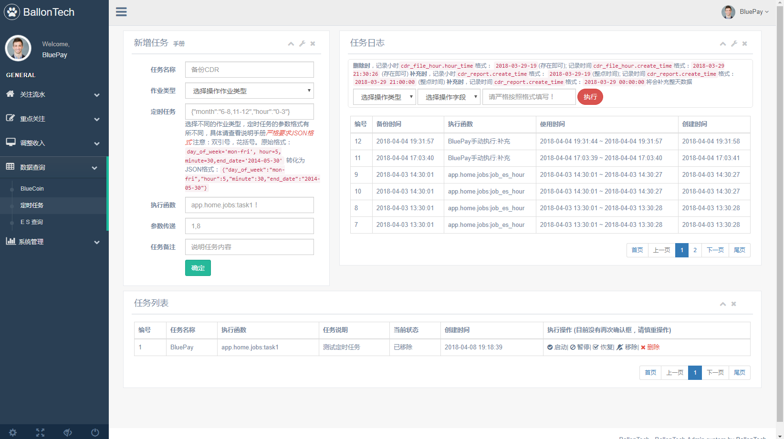
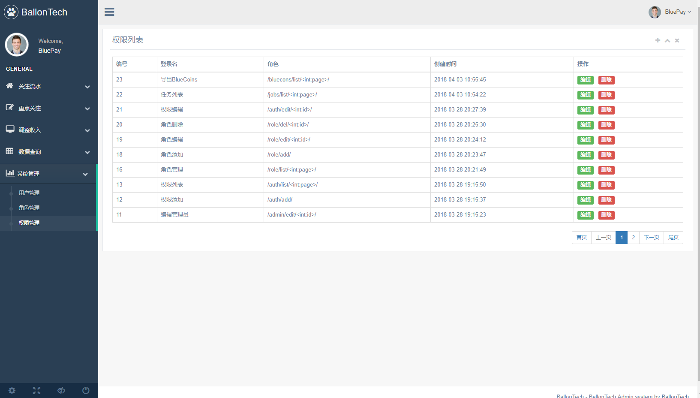
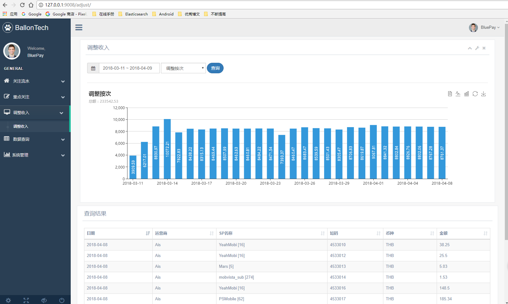

### 外部使用资源
- 项目开源模板 [模板地址](https://github.com/iogbole/gentelella_on_rails)
- 打包组件 pip3 freeze > requirements.txt

### 安装部署
- 相关配置压缩包 conf.zip
- 项目部署使用Nginx + uwsgi 组件
- 项目配置 uwsgi
    ```
    [uwsgi]
    base=/usr/share/nginx/www/subview/
    socket =  127.0.0.1:9008
    module=runweb:app
    master = true
    processes = 4
    threads = 2
    chdir =  %(base)
    logto =  %(base)/uwsgi.log
    pidfile=%(base)/uwsgi.pid
    post-buffering=40960
    buffer-size=32768000
    socket-timeout=10
    enable-threads = true
    daemonize= %(base)/daemonize.log
    
    
    
    
    # 定时任务
    [uwsgi]
    base=/usr/share/nginx/www/subview/
    socket =  0.0.0.0:9008
    protocol=http
    module=subview:app
    master = true
    processes = 4
    threads = 2
    callable = app
    chdir =  %(base)
    pidfile=%(base)/uwsgi.pid
    enable-threads=true


    ```
- 项目Nginx配置
    ```
    server{
        listen 9009;
        server_name _;
        access_log  /var/log/nginx/access_subview.log;
        error_log  /var/log/nginx/error_subview.log;
        location / {
            include uwsgi_params;
            uwsgi_pass 127.0.0.1:9008;
        }
    }

    ```
- 项目操作
    - 启动 /usr/local/bin/uwsgi --ini subview.ini
    - 关闭 kill -9 `cat uwsgi.pid`
 

- 项目部署使用Nginx + gunicorn 组件
- 启动项目配置
    ```
    bind='0.0.0.0:9012' 
    workers=2 #服务的进程数 
    backlog=1024 
    threads=4 #单个进程开启处理的线程数
    proc_name='gunicorn.pid'
    pidfile='/tmp/gunicorn.log'
    loglevel='info'
    preload=False

    ```
- 相关操作
    - `/usr/local/bin/gunicorn runweb:app -c gunicorn.conf -D`
    - 重新启动
        kill -HUP `cat gunicorn.pid`
    - 关闭
        kill `cat gunicorn.pid` 
    - nginx http代理
        
        ```
        server {
            listen 8008;
            server_name _;
            access_log  /var/log/nginx/access_9008.log;
            error_log  /var/log/nginx/error_9008.log;

            location /static/ {
                root /application/sub_view/sub_view/app/;
            }
            location / {
                    proxy_pass http://127.0.0.1:9008;
                    proxy_redirect     off;
                    client_max_body_size  10m;
                    proxy_set_header   Host                 $http_host;
                    proxy_set_header   X-Real-IP            $remote_addr;
                    proxy_set_header   X-Forwarded-For      $proxy_add_x_forwarded_for;
                    proxy_set_header   X-Forwarded-Proto    $scheme;
            }
        }

        ```

- 注意：受到APScheduler影响，项目最终选择 gunicorn 部署项目，解决动态添加定时任务无法生效问题
    ```
    import os
    chdir = os.path.dirname(os.path.realpath(__file__))
    bind = "0.0.0.0:9008"
    workers = 2
    backlog=1024
    threads=4
    loglevel='info'
    preload=False
    proc_name = 'subview_project'
    accesslog = "/tmp/gunicorn-access.log"
    errorlog = "/tmp/gunicorn-error.log"
    pidfile = "/tmp/gunicorn-pid.pid"
    daemon = True
    preload =True
    
    # 启动
    - /usr/local/bin/gunicorn -c gunicorn.ini subview:app
    - /usr/local/bin/gunicorn -w 4 -b 0.0.0.0:9008 subview:app --preload
    ```

- 项目功能截图


